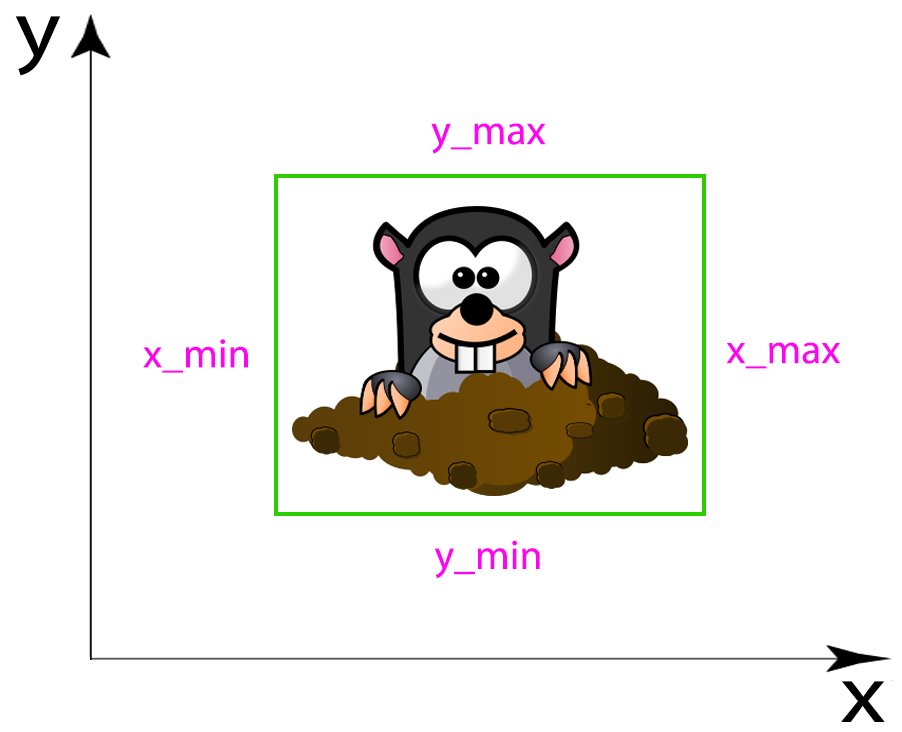

# Child-Computer Interaction database: ChildCIdbLong

## Table of content

- [Article](#article)
- [Download ChildCIdbLong](#download)
- [Description of ChildCIdbLong](#description)
- [Acquisition Process](#acquisition-process)
  - [Emotional State Self-Assessment](#acquisition-process)
  - [Block 1: Touch Analysis](#block1)
    - [Test 1: Tap and Reaction Time](#test1)
    - [Test 2: Drag and Drop](#test2)
    - [Tests 3 and 4: Zoom-in and Zoom-out](#test34)
  - [Block 2: Stylus Analysis](#block2)
    - [Test 5: Spiral Test](#test5)
    - [Test 6: Drawing Test](#test6)
- [References](#references)

 

## Article

J.C. Ruiz-Garcia, R. Tolosana, R. Vera-Rodriguez, A. Morales, J. Fierrez, J.
Ortega-Garcia and J. Herreros-Rodriguez, **"ChildCIdbLong: Longitudinal
Child-Computer Interaction Database and Quantitative Analysis for Child
Development"**, *International Journal of Human-Computer Studies*, (UNDER REVIEW).

 

## <a name="download">Download ChildCIdbLong</a>

Sorry, we are currently working on the license agreement and database
pre-processing/anonymisation for publication. **We will update this section as soon as
possible**.

For more information, please send an email to [**atvs@uam.es**](mailto:atvs@uam.es).

 

## <a name="description">Description of ChildCIdbLong</a>

**ChildCIdbLong is the largest publicly available dataset to date for research in the *e-Learning* and *e-Health* areas**. The research carried out with this database aims to generate a better understanding of children's cognitive and neuromotor development while interacting with mobile devices. 

This is the last version of an on-going dataset collected in collaboration with
the school [GSD Las
Suertes](https://www.gsdeducacion.com/Colegios/GsdLasSuertes) in Madrid, Spain.
**It comprises children aged 18 months to 8 years grouped into 7 different
educational levels (Groups 2 to 8)** according to the Spanish education system.
In particular, **ChildCIdbLong comprises 6 data acquisitions process with over 2.1K children's sessions and over 12.6K children's tests performed and collected in the last 4 academic years (from 2019/20 to 2022/23)**.

**Regarding gender, 50% of the children were male/female whereas, for the
handedness, more than 80% were right-handed**. In addition, other information
considered has been: ***i)* the previous experience of the children with mobile
devices, *ii)* the children’s grades at the school, and *iii)* information
regarding the attention-deficit/hyperactivity disorder (ADHD).**  

| # Acquisition (Date) | Academic Year | #Participants | Acquisition tool | Emotion | ADHD | Grades | Previous experience |
|:-:|:-:|:-:|:-:|:-:|:-:|:-:|:-:|
| 1st Acquistion  (Jan 2020) | 2019/20 | 438 | Finger/Stylus | ✔️ | ✔️ | ✔️ | ✔️ |
| 2nd Acquistion  (May 2021) | 2020/21 | 376 | Finger/Stylus | ✔️ | ✔️ | ✔️ | ✔️ |
| 3rd Acquistion  (Oct 2021) | 2021/22 | 315 | Finger/Stylus | ✔️ | ✔️ | ✔️ | ✔️ |
| 4th Acquistion  (Mar 2022) | 2021/22 | 328 | Finger/Stylus | ✔️ | ✔️ | ✔️ | ✔️ |
| 5th Acquistion  (Jun 2022) | 2021/22 | 328 | Finger/Stylus | ✔️ | ✔️ | ✔️ | ✔️ |
| 6th Acquistion  (Oct 2022) | 2022/23 | 331 | Finger/Stylus | ✔️ | ✔️ | ✔️ | ✔️ |

 

## Acquisition Process

We first capture the emotional state of the children before the beginning of the acquisition:

- ### Emotional State Self-Assessment (10 seconds)

    Three faces with different colours and facial expressions were represented on the screen, asking the children to touch one according to their emotional state using the finger as input.

  - **Filename:** `info.json`
  - **File structure:** a *Python dictionary (JSON)* whose keys are `{"timestamp, "emotion", "laterality"}`.  

The acquisition process comprises **6 different tests grouped in 2 main blocks: *1) Touch Analysis, and 2) Stylus Analysis.***

The first block comprises **4 different tests** with different levels of difficulty to see the ability of the children to perform different hand gestures and movements:

- ### <a name="test1">Test 1: Tap and Reaction Time (30 seconds)</a>

    The goal is to touch one mole at a time in order to see the ability of the children to perform tap gestures and their reaction times. Once the mole is touched, it disappears from that position and appears in another position of the screen.

    

  - **Filename:** `tap.txt`
  - **File structure:** A plain text file with tab-separated values where each column value is `[x, y, timestamp, x_min, x_max, y_min, y_max, pressure, inTarget, action]` in that order. 

        | Value | Description | Value | Description |
        |:-:|:-:|:-:|:-:|
        | `x` | X-coordinate. | `y_min` | Minimum Y-coordinate value for the mole. |
        | `y` | Y-coordinate. | `y_max` | Maximum Y-coordinate value for the mole. |
        | `timestamp` | Time instant at which the sample was taken for that row. | `pressure` | Pressure exerted by the child [0,1]. |
        | `x_min` | Minimum X-coordinate value for the mole. | `inTarget` | Indicates whether the child is touching the mole or not. |
        | `x_max` | Maximum X-coordinate value for the mole. | `action` | Indicates the type of action the child is performing  (0: starts pen-down, 1: starts pen-up, 2: pen-down). |

        In order to facilitate the comprehension of some values, the subset of `x_min, x_max, y_min, y_max` help us to identify the mole within the test coordinate system. Using these 4 values, a bounding box is formed which indicates the position, height and width of the mole on the plane.

        

 

- ### <a name="test2">Test 2: Drag and Drop (30 seconds)</a>

    The goal is to touch the carrot and swipe it to the rabbit.

    

  - **Filename:** `drag.txt`
  - **File structure:** A plain text file with tab-separated values where each column value is `[x, y, timestamp, x_min, x_max, y_min, y_max, pressure, inTarget, action]` in that order. 

        | Value | Description | Value | Description |
        |:-:|:-:|:-:|:-:|
        | `x` | X-coordinate. | `y_min` | Minimum Y-coordinate value for the rabbit. |
        | `y` | Y-coordinate. | `y_max` | Maximum Y-coordinate value for the rabbit. |
        | `timestamp` | Time instant at which the sample was taken for that row. | `pressure` | Pressure exerted by the child [0,1]. |
        | `x_min` | Minimum X-coordinate value for the rabbit. | `inTarget` | Indicates whether the child is touching the carrot or not. |
        | `x_max` | Maximum X-coordinate value for the rabbit. | `action` | Indicates the type of action the child is performing  (0: starts pen-down, 1: starts pen-up, 2: pen-down). |

        In order to facilitate the comprehension of some values, the subset of `x_min, x_max, y_min, y_max` help us to identify the rabbit within the test coordinate system. Using these 4 values, a bounding box is formed which indicates the position, height and width of the rabbit on the plane. ***This concept can be applied equally to tests 3 and 4.***

        

 

- ### <a name="test34">Tests 3 and 4: Zoom-in and Zoom-out (30 seconds each)</a>

    The goal is to enlarge/decrease the rabbit and put it inside the two red circles for a short time.

    

        
        
    

  - **Filename:** `more_zoom.txt` and `less_zoom.txt`
  - **File structure:** A plain text file with tab-separated values where each column value is `[x, y, timestamp, xCircle, yCircle, r1, r2, x_min, x_max, y_min, y_max, scale, pressure, inTarget, action]` in that order.  

    | Value | Description | Value | Description |
    |:-:|:-:|:-:|:-:|
    | `x` | X-coordinate. | `x_max` | Maximum X-coordinate value for the rabbit. |
    | `y` | Y-coordinate. | `y_min` | Minimum Y-coordinate value for the rabbit. |
    | `timestamp` | Time instant at which the sample was taken for that row. | `y_max` | Maximum Y-coordinate value for the rabbit. |
    | `xCircle` | X-coordinate of the centre of the circles. | `scale` | Scaling factor for the size of the rabbit. |
    | `yCircle` | Y-coordinate of the centre of the circles | `pressure` | Pressure exerted by the child [0,1]. |
    | `r1` | Radius of the inner circle. | `inTarget` | Indicates when the rabbit is between the two red circles. |
    | `r2` | Radius of the outer circle | `action` | Indicates the type of action the child is performing  (0: starts pen-down, 1: starts pen-up, 2: pen-down first finger, 3: pen-down second finger). |
    | `x_min` | Minimum X-coordinate value for the rabbit. | | |

  

The second block aimed to analyse the ability of the children to use the pen stylus by means of **2 different tests**:

- ### <a name="test5">Test 5: Spiral Test (30 seconds)</a>

    The goal is to go across the spiral from the inner part to the outer part, trying to keep it always in the area remarked in black colour.

    

  - **Filename:** `test1.txt`
  - **File structure:** A plain text file with tab-separated values where each column value is `[x, y, timestamp, pressure, inTarget, action]` in that order.  

    | Value | Description | Value | Description |
    |:-:|:-:|:-:|:-:|
    | `x` | X-coordinate. | `pressure` | Pressure exerted by the child [0,1]. |
    | `y` | Y-coordinate. | `inTarget` | Indicates whether the child draws inside the spiral or not. |
    | `timestamp` | Time instant at which the sample was taken for that row. | `action` | Indicates the type of action the child is performing  (0: starts pen-down, 1: starts pen-up, 2: pen-down). |

 

- ### <a name="test6">Test 6: Drawing Test (2 minutes)</a>

    The goal is to colour the top and trunk of the tree in the best way possible trying to fill it completely and draw always inside the area remarked in black colour.

    

  - **Filename:** `test2.txt`
  - **File structure:** A plain text file with tab-separated values where each column value is `[x, y, timestamp, pressure, inTarget, action]` in that order.  

    | Value | Description | Value | Description |
    |:-:|:-:|:-:|:-:|
    | `x` | X-coordinate. | `pressure` | Pressure exerted by the child [0,1]. |
    | `y` | Y-coordinate. | `inTarget` | Indicates whether the child draws inside the tree or not. |
    | `timestamp` | Time instant at which the sample was taken for that row. | `action` | Indicates the type of action the child is performing  (0: starts pen-down, 1: starts pen-up, 2: pen-down). |

 

## <a name="references">References</a>

For further information on the database and on different applications where it has been used, we refer the reader to:

- R. Tolosana, J.C. Ruiz-Garcia, R. Vera-Rodriguez, J. Herreros-Rodriguez, S. Romero-Tapiador, A. Morales and J. Fierrez, **"Child-Computer Interaction: Recent Works, New Dataset, and Age Detection"**, *IEEE Transactions on Emerging Topics in Computing*, doi: [10.1109/TETC.2022.3150836](https://www.doi.org/10.1109/TETC.2022.3150836), 2022.

- J.C. Ruiz-Garcia, C. Hojas, R. Tolosana, R. Vera-Rodriguez, A. Morales, J.
  Fierrez, J. Ortega-Garcia and J. Herreros-Rodriguez, **"Children Age Group
  Detection based on Human-Computer Interaction and Time Series Analysis"**,
  *International Journal on Document Analysis and Recognition (IJDAR)*, in press, 2024.

- J.C. Ruiz-Garcia, R. Tolosana, R. Vera-Rodriguez, J.
  Fierrez, J. Ortega-Garcia and J. Herreros-Rodriguez, **"ChildCI Framework: Analysis of Motor and Cognitive Development in Children-Computer Interaction for Age Detection"**,
  doi: [10.1109/TETC.2022.3150836](https://www.doi.org/10.1109/TETC.2022.3150836), 2022.

All these articles are publicly available in the [publications](http://atvs.ii.uam.es/atvs/listpublications.do) section of the BiDA group webpage. Please remember to reference the above articles on any work made public, whatever the form, based directly or indirectly on any part of the ChildCIdbLong database.
